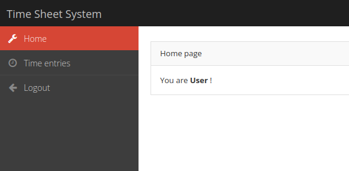
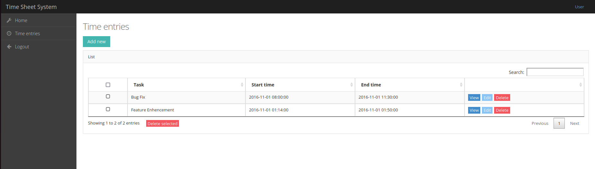

# Setting up & running the application
```bash
zafor@zafor:~/code_dir$ docker-compose up
zafor@zafor:~/code_dir$ docker exec -it [code_container_name]
root@88544e0a5cb3:/var/www/html$ composer update
root@88544e0a5cb3:/var/www/html$ cp .env.example .env
root@88544e0a5cb3:/var/www/html$ source .env
root@88544e0a5cb3:/var/www/html$ php artisan migrate:fresh --seed
```

```APP_KEY``` is included in ```.env.example``` file. But it should be regenerated for security measure.

```php artisan key:generate``` can be used for regenerate the commmand.

# Running test from containaer
```bash
./vendor/bin/phpunit
```
# GUI of the application
<div style="text-align: center;">



*Home Page*

</div>

<div style="text-align: center;">


*Time Entry Page*
</div>
    Time Entry Page
    
    * CRUD operation for application

## Two important route
```bash
http://localhost:8080/public/register
http://localhost:8080/public/login
```

## Code Structure

├── app/

│   ├── ...

├── bootstrap/

├── config/

├── database/

├── public/

├── resources/

├── routes/

├── storage/

├── tests/

├── vendor/

├── .env

├── .env.example

├── artisan

├── composer.json

├── composer.lock

├── server.php

├── Dockerfile

└── docker-compose.yml

## Limitation of the project/Future work
* Test coverage could be enhance
* Test case expect it database seed was done
* Filtering/searching it not covered in test
* UI/UX could better make better
* Fogot to use tear down :D
